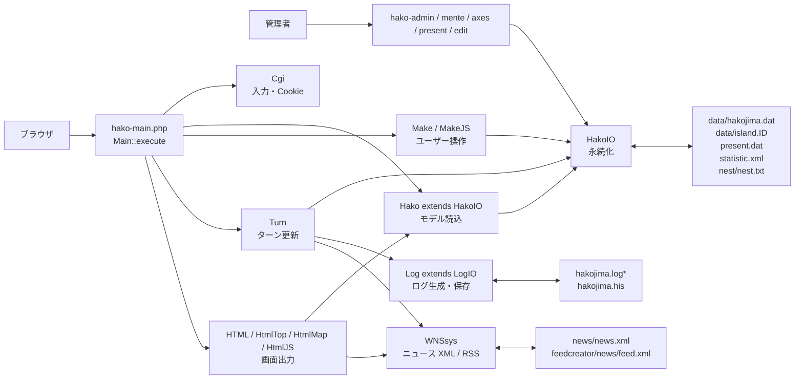
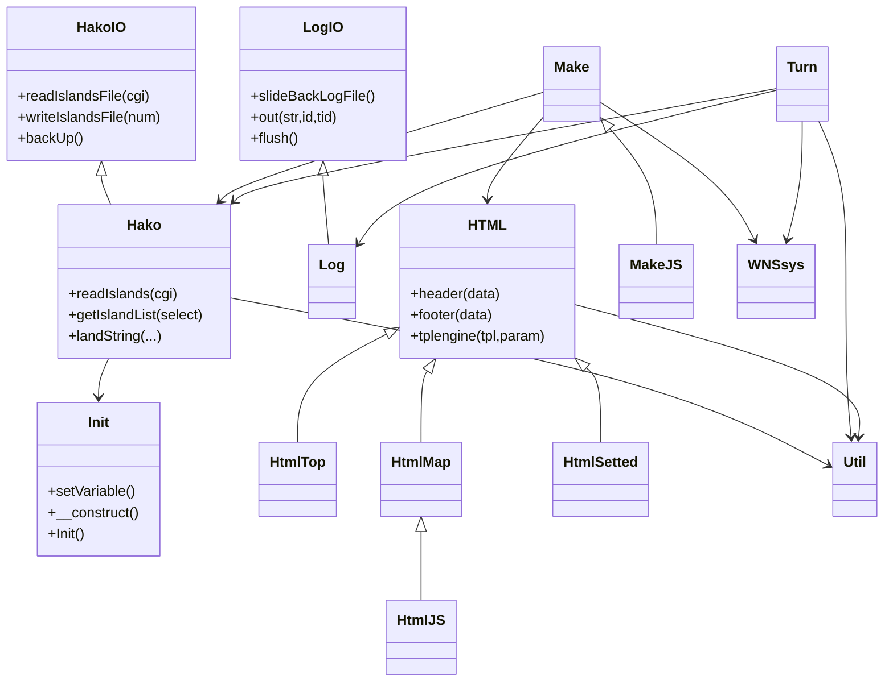
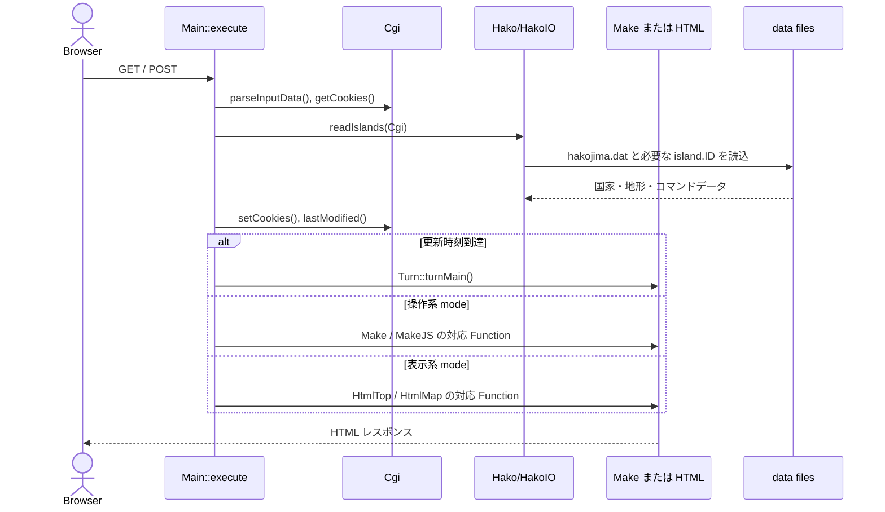
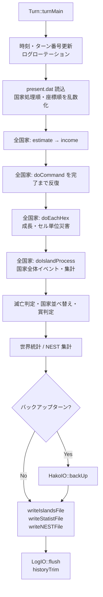

# bo-hako 現行コード設計書

## 1. 文書情報

| 項目 | 内容 |
|---|---|
| 対象 | `trade/` 配下の現行 PHP / JavaScript コード |
| 分析日 | 2026-07-11 |
| 主言語 | PHP（旧式の PHP 4 互換構文を含む）、JavaScript |
| 永続化 | 独自テキスト形式、XML、JSON |
| 目的 | 現行実装の責務、Function、呼び出し関係、データフローを保守者向けに可視化する |

本書は実装から逆算した As-Is 設計書である。コメントの一部は文字化けしているため、責務は関数名、呼び出し元、入出力、実際の処理から判定した。

### 1.1 分析範囲

- 詳細分析対象: `trade/` 直下の自作 PHP、`trade/views/`、`trade/partials/`、`trade/configs/`、自作 JavaScript。
- 参照関係のみ記載: `feedcreator/`、`jcode.phps`、jQuery 系、Flot、ExplorerCanvas、EnhanceJS 等の同梱外部ライブラリ。
- 対象外: `data/`、`data.bak*/`、画像、CSS、ログの内容、`tests/props_0.2/` の外部テスト用フレームワーク内部。
- PHP 内に文字列として出力される JavaScript Function は、ブラウザ側 Function として分けて記載する。

## 2. システム概要

本システムは、複数の国家（コード上は歴史的に `island` と表現）をターン制で更新するブラウザゲームである。DBMS は使用せず、国家基本情報を `data/hakojima.dat`、地形・コマンド・掲示板等を `data/island.<ID>` に保存する。

HTTP リクエストの大半は `hako-main.php` に集約される。アクセス時に保存データを読み、経過時刻が設定値 `Init::$unitTime` を超えると通常の表示要求であっても `turn` モードへ切り替え、全国家のターン処理を実行する。



## 3. 実行時構成

### 3.1 主要クラスの継承・依存



`Init` は各エントリーポイントで `$init = new Init` として生成され、`global $init` によるサービスロケータ兼設定オブジェクトとして利用される。依存性注入や名前空間は使われていない。

### 3.2 通常リクエスト



### 3.3 ターン更新

`HakoIO::readIslandsFile()` が、現在時刻と `islandLastTime` の差を判定して `Cgi::$mode = 'turn'` に変更する。`Main::execute()` は次の順で更新する。



## 4. エントリーポイントとルーティング

| ファイル | 起動 Function | 役割 |
|---|---|---|
| `hako-main.php` | `Main::execute()` | 一般画面、国家操作、ターン更新のフロントコントローラ |
| `hako-admin.php` | `Main::__construct()`, `Main::execute()` | 管理機能へのメニュー |
| `hako-mente.php` | `Main::execute()` | データ作成、削除、時刻操作、復元 |
| `hako-mente-safemode.php` | `Main::execute()` | safe_mode を想定した管理処理 |
| `hako-axes.php` | `Main::execute()` | アクセスログ表示 |
| `hako-present.php` | `Main::execute()` | 管理者による資金・食料・イベント付与 |
| `hako-edit.php` | `Main::execute()` | 管理者用マップ編集 |
| `NEST.php` | トップレベル処理 | NEST 統計 JSON API |
| `map-transfer.php` | トップレベル処理 | 指定国家のマップ・コマンド等を読み出す移行補助 |
| `wstat-rotate.php` | トップレベル処理 | `statistic.xml` の世代移行・年フィルタ |
| `GDtester.php` | トップレベル処理 | GD 描画確認 |

### 4.1 `hako-main.php` の mode 相関

| mode | 呼び出し先 | 種別 |
|---|---|---|
| `turn` | `Turn::turnMain()` → `HtmlTop::main()` | 全体更新後にトップ表示 |
| `owner` | `HtmlMap::owner()` / `HtmlJS::owner()` | 所有国家画面 |
| `command` | `Make::commandMain()` / `MakeJS::commandMain()` | コマンド登録・削除 |
| `new` | `Make::newIsland()` | 新規国家登録 |
| `comment` | `Make::commentMain()` | コメント更新 |
| `postnews` | `Make::NewsMain()` | ニュース投稿 |
| `Cname` | `Make::Capitalname()` | 首都名変更 |
| `flagUpload` | `Make::flagUpload()` | 国旗アップロード |
| `print` | `HtmlMap::visitor()` | 国家閲覧 |
| `targetView` | `HtmlMap::printTarget()` | 攻撃対象選択画面 |
| `change` | `Make::changeMain()` | 国家情報変更 |
| `ChangeOwnerName` | `Make::changeOwnerName()` | 国主名変更 |
| `freezeNation` | `Make::freezeNation()` | 国家凍結切替 |
| `regT` | `Make::regularTradeMain()` | 定期取引設定 |
| `lbbs` | `Make::localBbsMain()` | ローカル掲示板操作 |
| `skin` / `imgset` | `HtmlSetted::setSkin()` / `setImg()` | 表示設定完了画面 |
| `conf` / `New` | `HtmlTop::regist()` / `newDiscovery()` | 登録画面 |
| `log` / `wstat` / `nest` / `ally` | 対応する `HtmlTop` / `HtmlAlly` Function | ログ・統計・同盟表示 |
| 未指定 | `HtmlTop::main()` | トップ画面 |

## 5. データ設計

### 5.1 永続ファイル

| パス | 形式 | 読み書き | 主な Function |
|---|---|---|---|
| `data/hakojima.dat` | 行指向テキスト | R/W | `readIslandsFile`, `readIsland`, `writeIslandsFile`, `writeIsland` |
| `data/island.<ID>` | 固定長地形 + CSV 行 | R/W | `readIsland`, `writeLand`, `writeIsland` |
| `data/present.dat` | 独自テキスト | R/W/削除 | `readPresentFile`, `writePresentFile` |
| `data/hakojima.log0..N` | HTML 断片 | R/W/rename | `slideBackLogFile`, `logFilePrint`, `flush` |
| `data/hakojima.his` | HTML 断片 | R/W | `history`, `historyPrint`, `historyTrim` |
| `data/statistic.xml` | XML | R/W | `writeStatistFile`, `writeCCFile`, `World_Stat` |
| `nest/nest.txt` | JSON | R/W | `writeNESTFile`, `NEST_functions::MakeNEST`, `Nest_View` |
| `news/news.xml` | XML | R/W | `WNSsys::WriteXML`, `LatestRSS` |
| `feedcreator/news/feed.xml` | RSS | R/W | `WNSsys::UpdateRSS` |

`hakojima.dat` は全国家の概要を連続して保持し、`island.<ID>` は当該国家の詳細を保持する。詳細ファイルの先頭は 1 セル5桁（地形2桁16進 + 値3桁16進）の固定長マップで、その後にコマンド、ローカル掲示板、定期取引が続く。

### 5.2 実行時の主要データ構造

| 変数 | 概要 |
|---|---|
| `HakoIO::$islands[]` | 全国家。基本属性、資源、人口、施設集計、地形、コマンド、掲示板、定期取引、プレゼント等を含む連想配列 |
| `HakoIO::$idToNumber` | 国家 ID → `$islands` 添字 |
| `$island['land'][x][y]` | 地形種別コード |
| `$island['landValue'][x][y]` | 地形レベル、人口、耐久等の地形依存値 |
| `$island['command'][]` | `kind`, `target`, `x`, `y`, `arg` を持つコマンド列 |
| `$island['lbbs'][]` | ローカル掲示板メッセージ |
| `$island['regT'][]` | 定期取引設定 |
| `$island['nest'][]` | 勘定科目別の経済統計 |
| `Cgi::$dataSet` | POST / GET / Cookie を統合した画面・操作入力 |

## 6. ファイル別 Function 設計

以下の一覧は自作コードの宣言 Function を明記する。`hako-html.php` 内で HTML 文字列として生成される JavaScript は「ブラウザ側」と表示した。

### 6.1 `config.php`

クラス `Init` はゲームルール、地形・コマンド ID、コスト、表示設定、保存パス等を集約する。

| Function | 役割・主な相関 |
|---|---|
| `Init::setVariable()` | 他の設定値を基に、地形・コマンド・表示用派生配列を構築する |
| `Init::__construct()` | 旧形式コンストラクタ `Init()` を呼ぶ |
| `Init::Init()` | 開始時刻、乱数、派生設定、`Secret_Init` のパスワードを初期化する |

### 6.2 `hako-main.php`

| クラス | Function | 役割・主な相関 |
|---|---|---|
| `Hako extends HakoIO` | `readIslands(&$cgi)` | `readIslandsFile()` を呼び、表示に必要な国家一覧を組み立てる |
|  | `getIslandList($select=0)` | 国家選択用 HTML option を生成 |
|  | `getPrizeList($prize)` | 受賞コードを表示文字列へ変換 |
|  | `landString(...)` | 地形コード・値・表示モードからマップセル HTML を生成 |
| `LogIO` | `slideBackLogFile()` | 世代ログを後方へ rename |
|  | `logFilePrint($num=0)` | 指定世代ログを出力 |
|  | `historyPrint()` | 履歴ファイルを出力 |
|  | `history($str)` | 履歴バッファへ追加 |
|  | `historyTrim()` | 履歴を設定行数に切り詰める |
|  | `out($str,$id='',$tid='')` | 公開ログへ追加 |
|  | `secret($str,$id='',$tid='')` | 関係国限定ログへ追加 |
|  | `late($str,$id='',$tid='')` | 遅延公開ログへ追加 |
|  | `flush()` | バッファを `hakojima.log0` へ保存 |
|  | `infoPrint()` | ログバッファをデバッグ表示 |
| `Cgi` | `getCookies()` | Cookie を既定入力値へ展開 |
|  | `setCookies()` | POST 値を30日 Cookie に保存 |
|  | `parseInputData()` | POST/GET を正規化し、mode、端末種別、既定値を決定 |
|  | `lastModified()` | データファイル時刻を基に HTTP 更新ヘッダを処理 |
|  | `modifiedSinces($time)` | `If-Modified-Since` と更新時刻を比較 |
| `Main` | `execute()` | 全体の生成、読込、mode ルーティング、レスポンス出力 |

### 6.3 `hako-file.php`

クラス `HakoIO` が全永続化を担当する。

| Function | 役割・主な相関 |
|---|---|
| `readIslandsFile(&$cgi)` | 世界ヘッダと国家を読み、更新時刻到達時は `turn` に切り替える |
| `readIsland($fp,$num)` | 国家基本情報と、対象時は `island.<ID>` の地形・コマンド等を復元 |
| `writeLand($num,$island)` | 特定国家の地形データを書き換える |
| `readAllyFile()` | 同盟ファイルを読み、国家と同盟を関連付ける |
| `readAlly($fp)` | 同盟1件を配列へ変換 |
| `writeIslandsFile($num=0)` | 世界ヘッダと全国家を書き、詳細保存を `writeIsland()` に委譲 |
| `writeStatistFile($stat)` | 世界統計を XML に追記 |
| `writeNESTFile($nests)` | 国家経済統計を JSON ファイルへ追記・保存 |
| `writeCCFile()` | `statistic.xml` から別集計データを生成する補助処理 |
| `writeIsland($fp,$num,$island)` | 国家基本行と `island.<ID>` 詳細を直列化 |
| `backUp()` | `data.bak*` をローテーションし、現データを退避 |
| `rmTree($dirName)` | バックアップディレクトリを再帰削除 |
| `readPresentFile($erase=false)` | 管理者プレゼントを国家データへ読込み、任意で元ファイル削除 |
| `writePresentFile()` | プレゼント設定を保存 |

### 6.4 `hako-turn.php`

#### 操作受付: `Make`

| Function | 役割・主な相関 |
|---|---|
| `newIsland($hako,$data)` | 登録入力を検証し `makeNewIsland()` を実行、所有画面を表示 |
| `makeNewIsland()` | 新国家の属性、地形、初期コマンドを生成 |
| `commentMain($hako,$data)` | パスワード確認後に国家コメントを更新 |
| `NewsMain($hako,$data)` | ニュース入力を検証し `NewsPost()` へ渡す |
| `NewsPost($dataset)` | `WNSsys::Updater()` によりニュース XML/RSS を更新 |
| `Capitalname($hako,$data)` | 首都名を変更 |
| `flagUpload($hako,$data)` | アップロードを検証し国旗ファイルを保存 |
| `localBbsMain($hako,$data)` | ローカル掲示板の追加・削除 |
| `regularTradeMain($hako,$data)` | 定期取引の追加・削除 |
| `changeMain($hako,$data)` | 国名、パスワード等の国家設定を変更 |
| `changeOwnerName($hako,$data)` | 国主名を変更 |
| `freezeNation($hako,$data)` | 国家の凍結状態を切り替える |
| `commandMain($hako,$data)` | パスワード確認後にコマンド列を編集し、所有画面を再表示 |

`MakeJS extends Make` は `commandMain($hako,$data)` を上書きし、JavaScript UI 用のコマンド編集・再表示を行う。

#### ターンエンジン: `Turn`

| Function | 役割・主な相関 |
|---|---|
| `normalizeNumber($value,$default=0)` | 数値でない保存値を既定値へ正規化 |
| `normalizeInt($value,$default=0)` | 整数値へ正規化 |
| `normalizeIslandDefaults(&$island)` | 旧データに不足する国家キーを補完 |
| `turnMain(&$hako,$data)` | 全フェーズを統括し、バックアップ・保存・ログ確定まで行う |
| `logMatome($island)` | 同種の整地ログ等をまとめて出力 |
| `doCommand(&$hako,&$island)` | 先頭コマンド1件を検証・実行。完了状態を呼び出し元へ返す |
| `doEachHex(&$hako,&$island)` | 各マップセルの成長、火災、怪獣、局所災害等を処理 |
| `doIslandProcess($hako,&$island)` | 国家単位の人口・産業・政治・災害・船舶等を更新 |
| `countGrow($land,$landValue,$x,$y)` | 周辺地形から人口成長量を計算 |
| `wideDamage(...)` | 広域攻撃・災害ダメージを周辺セルへ適用 |
| `oilwideDamage(...)` | 油田等に関する広域ダメージを適用 |
| `islandSort(&$hako)` | 国家をポイント順に並べ、順位を更新 |
| `income(&$island)` | 生産、消費、税収、資源収支を反映 |
| `estimate(&$island)` | 地形を走査し、人口・産業・施設能力等を再集計 |
| `countAround($land,$x,$y,$kind,$range)` | 周囲の指定地形数を数える |
| `checkLand($land,$x,$y)` | 座標範囲・地形の有効性を確認 |
| `countAroundValue($island,$x,$y,$kind,$lv,$range)` | 地形種別と値を条件に周辺数を数える |
| `landName($land,$lv)` | 地形コード・値を表示名へ変換 |
| `doComCons($landt,$logtype)` | 建設系コマンドの成立条件・ログ種別を補助判定 |
| `ChkCapLevel($com,$caplv,$id,$name,$comName)` | 首都レベル要件を検証 |
| `comTrades(&$arg,$cost,&$goods,&$tgoods)` | 貿易量、費用、在庫を調整 |
| `comTradesN($kind,&$cost,&$container,&$str)` | 資源種別に応じた取引パラメータを解決 |
| `comTradeschk($kind,$turn)` | 定期取引の実行可否を判定 |
| `comMining($kind,$resdep)` | 地下資源の採掘量を計算 |
| `AutoNews($id,$name,$turn,$text,$category)` | 自動ニュースデータを作り `Make::NewsPost()` へ渡す |
| `popComp($x,$y)` | ポイント降順ソート用比較関数 |

`doComCons` 以降は宣言位置上は `Turn` の末尾にあるが、呼び出しは `Turn::...` とグローバル Function の両様式が混在している。保守時は中括弧の所属と PHP バージョン互換性を必ず確認すること。

### 6.5 `hako-html.php`

#### サーバー側 HTML 出力

| クラス | Functions | 役割・相関 |
|---|---|---|
| `HTML` | `header`, `footer`, `lastModified`, `watch`, `tplengine` | 共通 HTML 枠、圧縮、更新表示、簡易テンプレート展開 |
| `HtmlTop extends HTML` | `main`, `regist`, `newDiscovery`, `changeIslandInfo`, `changeOwnerName`, `freezeNation`, `setStyleSheet`, `setLocalImage`, `log`, `World_Stat`, `Nest_View`, `historyPrint` | トップ、登録、設定、ログ、世界統計、NEST 表示 |
| `HtmlMap extends HTML` | `owner`, `visitor`, `islandInfo`, `islandMap`, `regTHead`, `regTInputOW`, `regTContents`, `BalanceOutput`, `lbbsHead`, `lbbsInput`, `lbbsInputOW`, `lbbsContents`, `islandRecent`, `tempOwer`, `tempCommand`, `newIslandHead`, `printTarget` | 所有者・訪問者画面、マップ、コマンド、掲示板、定期取引 |
| `HtmlJS extends HtmlMap` | `header`, `tempOwer`, `tempCommand2` | JavaScript 操作 UI 版のヘッダ・所有画面・コマンド列 |
| `HtmlSetted extends HTML` | `setSkin`, `setImg`, `comment`, `News`, `Capital`, `change`, `lbbsDelete`, `lbbsAdd`, `commandDelete`, `commandAdd` | 操作完了メッセージを出力する static Function 群 |
| `HakoError` | `wrongPassword`, `wrongID`, `noDataFile`, `newIslandFull`, `tempNewIslandForbbiden`, `newIslandNoName`, `newIslandBadName`, `newIslandAlready`, `newIslandNoPassword`, `newIslandNoAgree`, `changeNoMoney`, `changeNothing`, `flagUploadError`, `problem`, `lbbsNoMessage`, `NewsNoText`, `NewsNoPoint`, `lockFail`, `lbbsNoMoney` | 入力・認証・排他・登録エラーの共通出力 |

#### ブラウザ側 Function

`HtmlMap` / `HtmlJS` が `<script>` として出力する Function は次のとおり。

| Function | 役割 |
|---|---|
| `ps(x,y[,ld,lv])` | 選択座標と地形情報をフォームへ反映 |
| `ns(x)` | 数値・国家選択値をフォームへ反映 |
| `settarget(part)`, `targetopen()` | 攻撃対象選択ウィンドウを制御 |
| `init()` | コマンド UI の初期化 |
| `cominput(theForm,x,k,z)` | コマンド入力値を設定 |
| `plchg()` | コマンド表示・入力部を切替 |
| `disp(str,bgclr)`, `outp()` | ツールチップ表示・消去 |
| `set_com(x,y,land)` | 地形クリックからコマンド候補を設定 |
| `SelectList(theForm)` | 選択リストを更新 |
| `moveLAYER`, `menuclose`, `Mmove`, `LayWrite`, `SetBG` | 旧ブラウザ互換レイヤー・メニュー操作 |
| `selCommand`, `Mup`, `setBorder`, `mc_out`, `mc_over` | コマンド選択と強調表示 |
| `comListMove`, `MoveFalse`, `MoveComList` | コマンド列の並べ替えアニメーション |
| `showElement`, `hideElement` | DOM 要素表示切替 |
| `chNum`, `chNumDo` | コマンド番号の変更 |

同名の `ps`, `ns`, `settarget`, `targetopen` は異なる画面用スクリプト内に複数回定義される。1レスポンス内でどの定義が出力されるかは呼ばれたテンプレート Function に依存する。

### 6.6 `hako-log.php`

`Log extends LogIO` はゲームイベントを HTML 文へ変換し、`LogIO::out()`, `secret()`, `late()`, `history()` のいずれかへ渡す。Function 間の構造はほぼ「イベント引数 → 文面生成 → 出力先選択」で共通する。

Function 一覧（宣言順）:

```text
discover, changeName, prize, dead, presentMoney, presentFood, DoNothing2,
Make, MakeAuto, Resource, NoGoods, NoAny, landFail, JoFail, BokuFail,
NoTownAround, landSuc, landSucMatome, maizo, noLandAround, EggFound, EggBomb,
Miyage, Syukaku, Bank, Eiseisuc, Eiseifail, EiseiAtts, EiseiAttf, EiseiLzr,
oilFound, Found, oilFail, MineFail, RoofFall, RoofFall2, bombSet, LevelUp,
bombFire, CrushElector, Hideri, PBSuc, hariSuc, monFly, Forbidden, msNoTenki,
msNoTarget, mslogS, mslog, msMonsCaughtS, msMonsCaught, MsDamageS,
MsRoofFallS2, MsRoofFallS, MsDamage, MsRoofFall2, MsRoofFall, msLDMountain,
msLDSbase, msLDMonster, msLDSea1, msLDLand, msPollution, msMonNoDamage,
msMonKill, senkanAttack, marineAttack, EiseiEnd, BariaAttack, msMonMoney,
msMonster, msNormal, msMutation, MsSleeper, MsWakeup, MonsWakeup, msGensyoS,
msGensyo, msNoBase, msMaxOver, NoFactory, msBoatPeople, monsSend, monsSendme,
sell, aid, propaganda, giveup, oilFuel, oilEnd, OilBomb, ParkMoney, ParkEvent,
ParkEventLuck, ParkEventLoss, ParkEnd, monsMoveDefence, MonsExplosion,
monsBunretu, monsMove, ZorasuMove, fire, firenot, wideDamageSea2,
wideDamageMonsterSea, wideDamageSea, wideDamageMonster, wideDamageWaste,
earthquake, eQDamage, EQDown, eQDamagenot, Resession, RsDamage, RsDamagenot,
Starve, svDamage, popDamage, popDec, tsunami, tsunamiDamage, monsCome,
ZorasuCome, monsCall, monsWarp, MonsMoney, MonsFood, MonsMoney2, MonsFood2,
falldown, falldownLand, typhoon, typhoonDamage, hugeMeteo, HardRain, HardRain2,
NoTree, IncTree, IncTree2, NewTree, monDamage, meteoSea, meteoMountain,
meteoSbase, meteoMonster, meteoSea1, meteoNormal, eruption, eruptionSea1,
eruptionSea, eruptionNormal, tansakuoil, NoSeaAround, NoShoalAround, NoSea,
NoPort, NoPortT, ComeBack, maxShip, ClosedPort, VikingCome, VikingAway,
VikingAttack, RobViking, RunAground, msInterceptS, msIntercept, IsFail,
gvAlert, gvDemo, gvRob, InvestSuc, InvestDel, InvestFail, PropaFail,
ProductStop, ShowProduct, TrSuc, TrFail, CutSecpol, Strike, Booming,
Shrinking, FBSuc, DesGov, FBDeb, Debuger, NESTDebuger, CommonDebuger
```

主な相関カテゴリ:

- `Make` / `Resource` / `landSuc` 系: `Turn::doCommand()` から呼ばれるコマンド結果。
- `ms*`, `senkanAttack`, `marineAttack`: ミサイル・艦船攻撃結果。
- `mons*`, `Zorasu*`: 怪獣の出現・移動・被害。
- `earthquake` から `eruption*`: `doEachHex()` / `doIslandProcess()` の災害結果。
- `Invest*`, `ProductStop`, `Strike`, `Booming`: `income()` / `doIslandProcess()` の経済・政治イベント。
- `Debuger`, `NESTDebuger`, `CommonDebuger`: 診断ログ。

### 6.7 `hako-util.php`

クラス `Util` の static 呼び出しを前提とした共通 Function 群。

| Functions | 役割 |
|---|---|
| `aboutMoney`, `expToLevel`, `monsterSpec`, `nameToNumber`, `islandName` | 値・コードの表示変換、レベル・名称解決 |
| `Rewriter`, `Rewriter2`, `Replacer` | 数値単位・文字列の置換整形 |
| `MKCal` | ターン番号をゲーム内暦へ変換 |
| `Makewstat`, `Makepstat`, `Makemstat`, `arrdata` | XML 統計の世界・人口・軍事系列を配列化 |
| `MakeNest`, `MakeNest2` | NEST JSON の抽出・表示用整形 |
| `array_merge_x` | 再帰的配列マージ |
| `checkPassword`, `encode` | パスワード照合・ハッシュ化 |
| `conv_LF`, `euc_convert`, `sjis_convert` | 改行・文字コード変換 |
| `random`, `makeRandomPointArray`, `randomArray` | 乱数とランダム処理順生成 |
| `slideBackLbbsMessage`, `slideLbbsMessage` | 掲示板配列のシフト |
| `slideregT`, `regTpush`, `slideFront`, `slideBack` | 定期取引・一般配列・コマンド列操作 |
| `checkShip` | 艦船状態判定 |
| `lockw`, `lockr`, `unlock` | ファイル排他ロック。失敗時は `HakoError::lockFail()` |

### 6.8 ニュース・統計・同盟

| ファイル / クラス | Function | 役割・相関 |
|---|---|---|
| `wns.php` / `WNSsys` | `Updater` | `WriteXML()` と `UpdateRSS()` を統括 |
|  | `WriteXML` | ニュース XML に新規項目を追加 |
|  | `UpdateRSS` | FeedCreator を使って RSS を再生成 |
|  | `LatestRSS` | 最新ニュースを配列化 |
|  | `XMLcounter` | XML 要素数を数える |
|  | `MakeHTML` | 最新ニュース一覧 HTML を生成 |
| `NEST.php` / `NEST_functions` | `MakeNEST` | 年、国家 ID、mode で NEST JSON を絞り込む |
| `hako-ally.php` / `HtmlAlly` | `allyTop`, `allyInfo`, `amityOfAlly`, `newAllyTop` | 同盟トップとテンプレート表示。後二者は現状空実装 |

### 6.9 管理機能

| ファイル / クラス | Functions | 役割 |
|---|---|---|
| `hako-admin.php` / `HtmlEntrance` | `enter` | 管理メニューを出力 |
| `hako-admin.php` / `Main` | `__construct`, `execute` | safe_mode に応じた遷移先を作り表示 |
| `hako-admin.php` / ブラウザ側 | `go(obj)` | 選択された管理メニュー URL へ画面遷移 |
| `hako-mente.php`, `hako-mente-safemode.php` / `HtmlMente` | `enter`, `main`, `dataPrint`, `timeToString` | 管理フォーム、データ・時刻表示 |
| 同 / `Main` | `execute`, `parseInputData`, `newMode`, `delMode`, `timeMode`, `stimeMode`, `currentMode`, `rmTree`, `passCheck` | 認証後にデータ作成・削除・時刻変更・復元 |
| `hako-axes.php` / `HtmlMente` | `enter`, `main`, `dataPrint` | アクセスログ画面 |
| 同 / `Main` | `execute`, `parseInputData`, `passCheck` | 管理認証とログ表示ルーティング |
| `hako-present.php` / `HtmlPresent` | `enter`, `main` | プレゼント・処罰入力画面 |
| 同 / `Hako` | `init` | プレゼント用国家状態初期化（呼び出しあり。宣言位置は要確認） |
| 同 / `Main` | `execute`, `parseInputData`, `present`, `punish`, `passCheck` | 認証、入力解析、付与内容保存 |
| `hako-edit.php` / `Hako` | `readIslands`, `getLandList`, `landString` | 編集用データ読込、地形候補、セル描画 |
| 同 / `Cgi` | `parseInputData` | 編集入力解析 |
| 同 / `Edit` | `enter`, `main`, `editMap`, `regist` | 国家選択、マップ編集、保存 |
| 同 / `Main` | `execute` | `list`, `map`, `regist` のルーティング |

### 6.10 小規模補助ファイル

| ファイル | Functions / 処理 | 役割 |
|---|---|---|
| `GDtester.php` | `HTML_Out`, `Data_load`, `Graphic_land`, `Graphic_Out` | GD の地形描画試験 |
| `map-transfer.php` | Function 宣言なし | ID とパスワードを受けて国家詳細を復号・読込する移行補助 |
| `wstat-rotate.php` | Function 宣言なし | 古い統計 XML を退避し、指定年以降を新ファイルへ移す |
| `rewrite.php` | Function 宣言なし | 文字列置換用の単発保守スクリプト |
| `hako-admin_mapchips.php` | Function 宣言なし | 管理マップチップ定義・出力 |
| `secret_configs.php` | `Secret_Init`（Function なし） | マスターパスワード等を保持 |
| `views/layout-left.php` | Function 宣言なし | `partials/card-resource.php` を読み込むビュー |
| `partials/card-resource.php` | Function 宣言なし | 国家資源カードを出力 |
| `configs/resources.domain.php` | Function 宣言なし | 資源のドメイン定義 |
| `configs/resources.ui.php` | Function 宣言なし | 資源表示定義 |
| `configs/command.ui.php` | Function 宣言なし | コマンド UI 定義 |

### 6.11 自作 JavaScript と同梱ライブラリ

| ファイル | Function | 役割 |
|---|---|---|
| `hako.js`（および `scripts/hako.js`） | `Navi(position,img,title,pos,text,exp)` | ナビゲーション表示と説明パネル初期化 |
| `visualize.jQuery.js` | `scrapeTable` と内部の `dataGroups`, `allData`, `dataSum`, `topValue`, `bottomValue`, `memberTotals`, `yTotals`, `topYtotal`, `totalYRange`, `xLabels`, `yLabels`, `pie`, `line`, `area`, `bar` | HTML table を Canvas グラフ化 |

次は外部または汎用ライブラリであり、本システム固有 Function の呼び出し関係から分離する。

- `feedcreator/include/feedcreator.class.php`: RSS/Atom/HTML/MBOX/OPML フィード生成。`WNSsys::UpdateRSS()` から利用。
- `jcode.phps`: 日本語文字コード変換。入力解析から `JcodeConvert()` を利用。
- `jquery.flot.js`, `visualize.jQuery.js`: 統計グラフ描画。
- `exvalidation.js`, `exchecker-ja.js`: フォーム検証。
- `excanvas.js`: 旧 IE Canvas 互換。
- `autoresize.jquery.js`, `jquery.maxlength.js`, `jquery.li-scroller.1.0.js`: UI 補助。
- `EnhanceJS/enhance.js`: progressive enhancement 用汎用ライブラリ。

## 7. 主要な Function 相関表

| 起点 | 直接の主要呼び出し | 結果 |
|---|---|---|
| `Main::execute` | `Cgi::*`, `Hako::readIslands`, 各 mode の HTML / Make / Turn | 1リクエスト全体を完結 |
| `Hako::readIslands` | `HakoIO::readIslandsFile`, `getIslandList` | 永続データを表示・更新可能なモデルへ変換 |
| `Make::commandMain` | `Util::checkPassword`, 配列スライド、`HakoIO::writeIslandsFile`, `HtmlMap::owner` | コマンド列を変更して所有画面を返す |
| `Make::NewsMain` | `NewsPost` → `WNSsys::Updater` → `WriteXML` / `UpdateRSS` | XML と RSS を同期更新 |
| `Turn::turnMain` | `estimate`, `income`, `doCommand`, `doEachHex`, `doIslandProcess`, `HakoIO::*`, `LogIO::*` | 1ターン分の全世界更新を永続化 |
| `Turn::doCommand` | `Util::*`, `Turn` 補助 Function、`Log::*` | 1国家のコマンド1件を実行しログ化 |
| `Turn::doEachHex` | `countGrow`, `wideDamage`, `Log::*` | 地形単位更新と災害ログ化 |
| `Turn::doIslandProcess` | `estimate`, `Util::*`, `Log::*`, `AutoNews` | 国家単位の状態・イベント更新 |
| `HtmlMap::owner` | `islandInfo`, `islandMap`, `tempOwer`, `lbbs*`, `regT*` | 所有者向け統合画面 |
| `HtmlMap::visitor` | `islandInfo`, `islandMap`, `islandRecent`, `lbbsContents` | 閲覧者向け統合画面 |
| `HakoIO::writeIslandsFile` | `writeIsland`, `Util::lockw/unlock` | 世界と国家詳細をファイルへ保存 |

## 8. 非機能・運用上の設計

### 8.1 排他制御

ファイル読込は `Util::lockr()`、書込は `Util::lockw()`、完了時は `Util::unlock()` を使う。ただしすべての単発保守スクリプトが同じ規約を守るわけではないため、Web 実行中の `map-transfer.php`、`wstat-rotate.php` 等の利用には注意が必要である。

### 8.2 バックアップ

`Turn::turnMain()` は `islandTurn % Init::$backupTurn == 0` のとき `HakoIO::backUp()` を実行する。既存 `data.bakN` を後方へローテーション後、現 `data` を `data.bak0` へ移し、新しい `data` を作成して必要なログ・統計を戻す。

### 8.3 認証

- 国家操作: `Util::checkPassword()` で国家パスワードを照合。
- 管理操作: `Init::$masterPassword` と入力 `PASSWORD` を直接比較。
- 秘密値: `secret_configs.php` の `Secret_Init` から `Init` へコピー。
- Cookie に国家パスワードを保存する設計であるため、HTTPS、Cookie 属性、ログ出力には特に注意が必要。

### 8.4 文字コード

`JcodeConvert()`、`mb_convert_encoding()`、`euc_convert()`、`sjis_convert()` が混在し、一部 XML は `SHIFT_JIS` 宣言、PHP ソース・データの一部は UTF-8/SJIS 自動判定となっている。現状のコメントや文字列には文字化けが存在するため、一括変換はデータ互換性を検証してから行う必要がある。

## 9. 現行コードから確認できる注意点

以下は設計上の推測ではなく、静的な参照関係に不整合または高い保守リスクが見える箇所である。

1. `hako-main.php` は `DEVELOPEMODE == 'adv'` で `new HtmlAdv` を生成するが、分析範囲内に `HtmlAdv` 宣言がない。
2. `mode == 'report'` で `HtmlTop::report()` を呼ぶが、`HtmlTop` に同 Function の宣言がない。
3. `hako-present.php` は `Hako::init()` を呼ぶ一方、同ファイルの宣言抽出では `init` が確認できない。継承元 `HakoIO` にもない。
4. `hako-ally.php::allyTop($hako)` は `$this->allyinfo($hako)` と引数付きで呼ぶが、宣言 `allyInfo()` は引数なしである。
5. `hako-turn.php` では `estimate()` の宣言引数と一部呼び出し引数の数、補助 Function の static / instance 呼び出し様式が揺れている。対象 PHP バージョンにより警告・エラーになり得る。
6. `class Main`, `class Hako`, `class HtmlMente` が複数エントリーファイルに同名で存在する。現在は各エントリーポイントを個別ロードする前提で成立しており、まとめて require すると再宣言エラーになる。
7. `hako-html.php` は PHP から大量の JavaScript を文字列出力し、同名 Function を複数定義する。画面部品の合成変更時に上書き順の影響を受ける。
8. SQL のトランザクション相当機構がなく、複数ファイル（世界、国家、統計、NEST、ログ）の更新は原子的ではない。途中失敗時に世代間不整合が残る可能性がある。
9. 入力値が連想配列へ動的に取り込まれ、HTML 文字列連結も多い。入力検証、HTML エスケープ、パストラバーサル、アップロード検証は変更時に個別確認が必要。

## 10. 変更時の影響範囲ガイド

| 変更内容 | 主対象 | 併せて確認する箇所 |
|---|---|---|
| 新しい地形を追加 | `config.php`, `Turn::doEachHex`, `Hako::landString` | `estimate`, `landName`, 画像、編集画面、マップチップ |
| 新しいコマンドを追加 | `config.php`, `Turn::doCommand` | `Make::commandMain`, `HtmlMap::tempCommand`, JS UI、ログ Function |
| 国家属性を追加 | `HakoIO::readIsland`, `writeIsland` | `normalizeIslandDefaults`, `estimate`, 管理編集、バックアップ互換性 |
| ターン収支を変更 | `Turn::income`, `estimate` | 統計、NEST、ログ、画面資源カード |
| 災害を追加 | `doEachHex` または `doIslandProcess` | `hako-log.php`, 地形画像、設定確率、広域ダメージ補助 |
| ニュースを変更 | `Make::NewsMain`, `WNSsys` | XML/RSS 形式、`HtmlTop::main`, `AutoNews` |
| 画面入力を追加 | `Cgi::parseInputData`, 対応 `Make` Function | Cookie、HtmlMap/HtmlJS 両 UI、エスケープ処理 |
| 保存形式を変更 | `HakoIO` の read/write 両方 | `map-transfer.php`, 管理ツール、既存データ・バックアップ移行 |

## 11. 保守者向け読解順序

1. `config.php` で地形・コマンド・ターン設定を把握する。
2. `hako-main.php::Main::execute()` で入口と mode を追う。
3. 表示変更は `hako-html.php`、操作変更は `hako-turn.php::Make` を追う。
4. ターンロジックは `Turn::turnMain()` から `doCommand` → `doEachHex` → `doIslandProcess` の順に読む。
5. 保存形式は `hako-file.php::readIsland()` と `writeIsland()` を必ず対で確認する。
6. イベントの文面・公開範囲は `hako-log.php` と `LogIO` を確認する。
